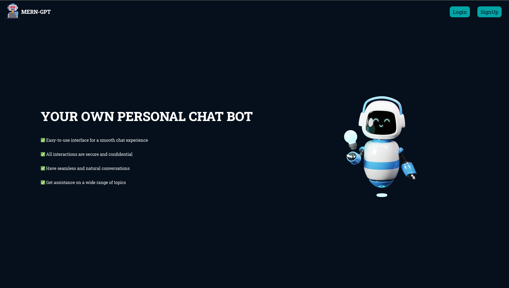
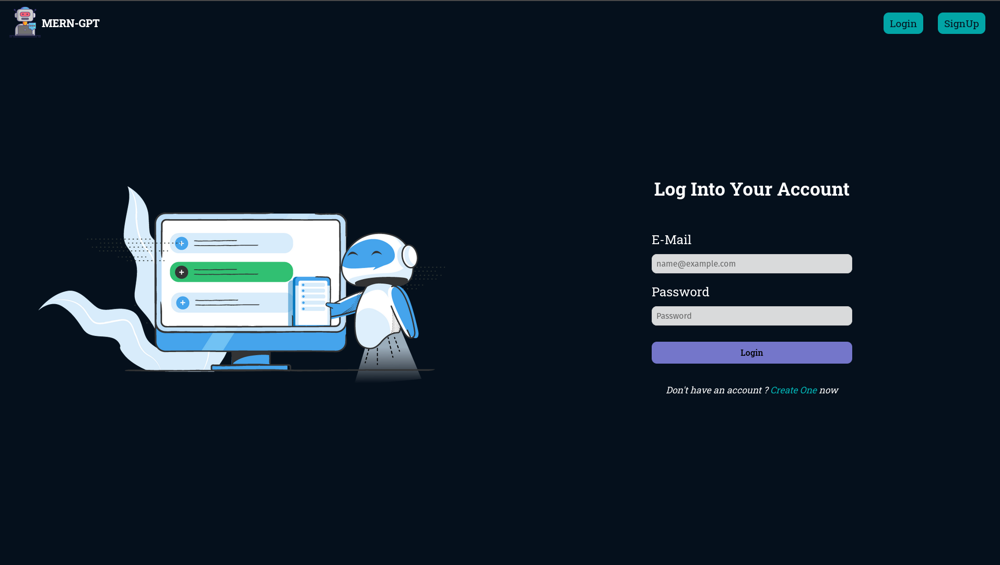
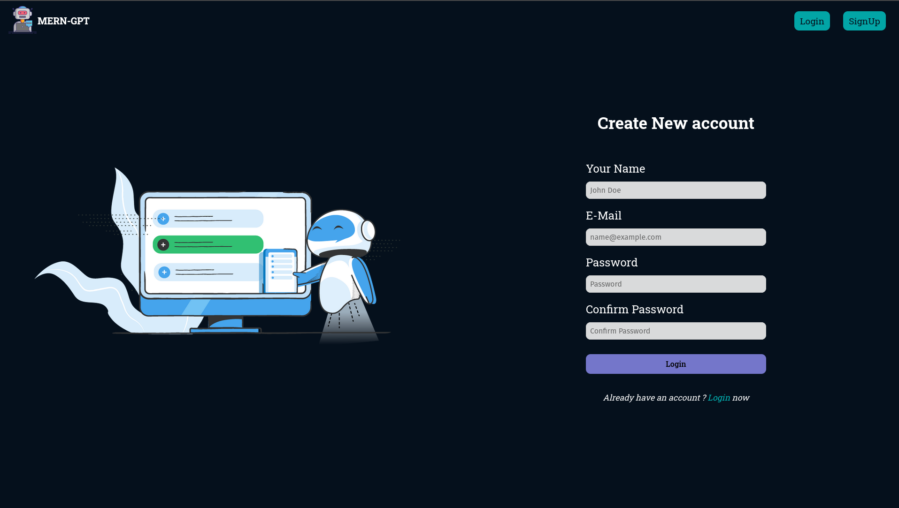
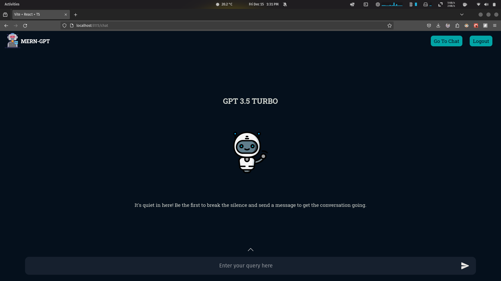
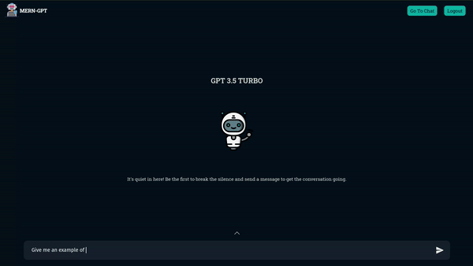

# Chat Bot

## Overview

This project is a chat bot leveraging OpenAI's GPT-3.5 Turbo model, implemented
using React for the front end, Express for the backend, and MongoDB for data
storage. The application provides users with an interactive interface to engage
in natural language conversations with the GPT-3.5 Turbo model.

## Features

- **Conversational Interface:** Users can have dynamic and natural language
  conversations by inputting prompts or queries.

- **Backend Integration:** The Express backend manages communication with the
  OpenAI API, handling requests and responses seamlessly.

- **Data Persistence:** MongoDB is employed for storing user data, including
  prompts and model responses.

## Prerequisites

Before running the application, ensure you have the following installed:

- Node.js
- npm (Node Package Manager)
- MongoDB

## Setup

1.  Clone the repository:

    ```bash
    git clone https://github.com/yashkathe/AI-Chat-Bot-MERN.git
    ```

2.  Navigate to the project directory:

    ```bash
    cd AI-Chat-Bot-MERN
    ```

3.  Install dependencies for both the client and server:

    ```bash
    # Install frontend dependencies
    cd frontend
    npm install

    # Install backend dependencies
    cd backend
    npm install
    ```

4.  Configure environment variables:

    Modify the `.env.txt` file in the `backend` directory and add the following variables and rename it to `.env`:

        ```bash
        OPENAI_API_KEY=your_openai_api_key
        MONGODB_URI=your_mongodb_uri
        ```

5.  Start the application:

    ```bash
    # Start the client (in the frontend directory)
    cd frontend
    npm run dev

    # Start the server (in the backed directory)
    cd backend
    npm run dev
    ```

## Notes

- Make sure to replace `your_openai_api_key` and `your_mongodb_uri` with your
  actual OpenAI API key and MongoDB connection URI in the `.env` file.

## Website Screenshots

### Home Page



### Login Page



### SignUp Page



### Chat Page



## Website Demo


